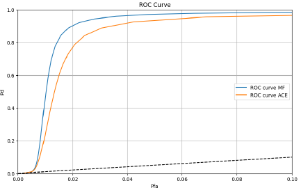

# Hyperspectral Target Detection: Matched Filter vs. Adaptive Coherence Estimator (ACE)

This repository contains the implementation and comparative analysis of two hyperspectral image target detection algorithms—Matched Filter (MF) and Adaptive Coherence Estimator (ACE). 
This project was submitted as part of the "Selected Topics in Image Processing" course under the guidance of Prof. Stanley Rotman at Ben-Gurion University.

## Data set

Our data set is a new hyperspectral data set of collecting UAS imagery of various man-made objects for support of research into the ability of hyperspectral imaging (HSI) systems to detect the presence of subpixel, or unresolved, objects.

Initially, we preprocessed the hyperspectral imagery by cropping out the black edges to ensure they did not interfere with the analysis (cube_processing file inculde the code).
Following this, we employed segmentation techniques to partition the image into distinct segments. For each segment, we calculated the mean spectral signature, which we then used as a target signature added to each pixel within the segment (segmentation.py file iclude the code).
This preparation facilitated a detailed comparison of the target detection capabilities of the Adaptive Coherence Estimator (ACE) and the Matched Filter (MF) algorithms under controlled conditions.
By analyzing the performance of both algorithms, we aimed to determine their relative effectiveness and accuracy in identifying the added target signatures across different segments.

## Results
The project results demonstrate the performance differences between the MF and ACE algorithms under varying target strengths and background conditions. Detailed analysis includes histograms, inverse cumulative probability distributions, and ROC curves.

## Innovation
Our innovation focuses on scenarios where the target spectrum signature is known, but there exists a dimensional mismatch between the hyperspectral image and the target spectrum. 
To simulate this scenario, we selected a target from our hyperspectral cube. We then intentionally introduced random corruptions into the spectrum of the chosen target pixel to emulate the mismatch between the hyperspectral image and the target.
To address this mismatch, we employed a smoothing technique to effectively reconstruct the missing elements of the target spectrum.

We chose this pixel:

We randomly correpted his spectrum and then used a smoothing technique:

## Innovation results

The analysis indicates that the implemented smoothing technique effectively maintains the integrity of the target detection algorithms.

